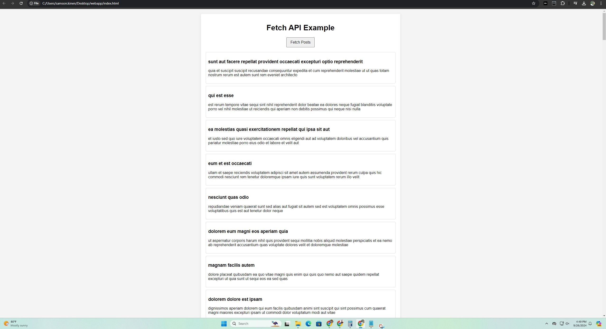

#a simple web app with fetch data from an API
---
Below is a simple web app that uses HTML, CSS, and JavaScript to fetch data from an API. In this example, we'll use the JSONPlaceholder API, which is a free fake online REST API for testing and prototyping.




### Project Structure
```
/my-web-app
  ├── index.html
  ├── styles.css
  └── script.js
```

### index.html
```html
<!DOCTYPE html>
<html lang="en">
<head>
    <meta charset="UTF-8">
    <meta name="viewport" content="width=device-width, initial-scale=1.0">
    <title>Fetch API Example</title>
    <link rel="stylesheet" href="styles.css">
</head>
<body>
    <div class="container">
        <h1>Fetch API Example</h1>
        <button id="fetchButton">Fetch Posts</button>
        <div id="posts" class="posts"></div>
    </div>
    <script src="script.js"></script>
</body>
</html>
```

### styles.css
```css
body {
    font-family: Arial, sans-serif;
    background-color: #f4f4f4;
    margin: 0;
    padding: 20px;
}

.container {
    max-width: 800px;
    margin: auto;
    background: white;
    padding: 20px;
    border-radius: 5px;
    box-shadow: 0 2px 10px rgba(0,0,0,0.1);
}

h1 {
    text-align: center;
}

button {
    display: block;
    margin: 20px auto;
    padding: 10px 15px;
    font-size: 16px;
    cursor: pointer;
}

.posts {
    margin-top: 20px;
}

.post {
    border: 1px solid #ddd;
    padding: 10px;
    margin-bottom: 10px;
    border-radius: 5px;
}
```

### script.js
```javascript
document.getElementById('fetchButton').addEventListener('click', fetchPosts);

function fetchPosts() {
    fetch('https://jsonplaceholder.typicode.com/posts')
        .then(response => {
            if (!response.ok) {
                throw new Error('Network response was not ok');
            }
            return response.json();
        })
        .then(data => {
            displayPosts(data);
        })
        .catch(error => {
            console.error('There was a problem with the fetch operation:', error);
        });
}

function displayPosts(posts) {
    const postsContainer = document.getElementById('posts');
    postsContainer.innerHTML = ''; // Clear previous posts
    posts.forEach(post => {
        const postDiv = document.createElement('div');
        postDiv.classList.add('post');
        postDiv.innerHTML = `<h3>${post.title}</h3><p>${post.body}</p>`;
        postsContainer.appendChild(postDiv);
    });
}
```

### Instructions to Run
1. Create a folder called `my-web-app` and create three files inside it: `index.html`, `styles.css`, and `script.js`.
2. Copy the respective code snippets into these files.
3. Open `index.html` in your web browser.

### Explanation
- **HTML**: Contains a button to fetch posts and a div to display the fetched posts.
- **CSS**: Basic styling to improve the look of the app.
- **JavaScript**: Uses the Fetch API to get posts from JSONPlaceholder when the button is clicked and displays them on the page.

Feel free to modify the code as needed to customize the web app further!


Let's break down the JavaScript code step-by-step.

### JavaScript Code Breakdown

#### 1. Event Listener for Button Click
```javascript
document.getElementById('fetchButton').addEventListener('click', fetchPosts);
```
- This line selects the button element with the ID `fetchButton`.
- It adds an event listener that listens for a `click` event. When the button is clicked, the `fetchPosts` function is called.

#### 2. Fetching Posts
```javascript
function fetchPosts() {
    fetch('https://jsonplaceholder.typicode.com/posts')
        .then(response => {
            if (!response.ok) {
                throw new Error('Network response was not ok');
            }
            return response.json();
        })
        .then(data => {
            displayPosts(data);
        })
        .catch(error => {
            console.error('There was a problem with the fetch operation:', error);
        });
}
```
- **`fetch('https://jsonplaceholder.typicode.com/posts')`**: This initiates a network request to the specified URL to retrieve a list of posts.
- **`.then(response => { ... })`**: This is a promise that waits for the response. When the response is received, the first `.then` block is executed.
  - **`if (!response.ok)`**: This checks if the response was successful (status code 200–299). If not, it throws an error.
  - **`return response.json();`**: If the response is okay, this line converts the response data to JSON format, which is another promise.
- **`.then(data => { ... })`**: Once the data is ready, this block is executed with the fetched data.
  - **`displayPosts(data)`**: This function is called to handle the display of the fetched posts.
- **`.catch(error => { ... })`**: If any error occurs during the fetch or processing, it is caught here and logged to the console.

#### 3. Displaying Posts
```javascript
function displayPosts(posts) {
    const postsContainer = document.getElementById('posts');
    postsContainer.innerHTML = ''; // Clear previous posts
    posts.forEach(post => {
        const postDiv = document.createElement('div');
        postDiv.classList.add('post');
        postDiv.innerHTML = `<h3>${post.title}</h3><p>${post.body}</p>`;
        postsContainer.appendChild(postDiv);
    });
}
```
- **`const postsContainer = document.getElementById('posts');`**: This selects the div where the posts will be displayed.
- **`postsContainer.innerHTML = '';`**: This clears any previously displayed posts. It ensures that every time you fetch posts, the previous ones are removed.
- **`posts.forEach(post => { ... })`**: This loops through each post in the array of fetched posts.
  - **`const postDiv = document.createElement('div');`**: Creates a new div element for each post.
  - **`postDiv.classList.add('post');`**: Adds the CSS class `post` to style the div.
  - **`postDiv.innerHTML = `<h3>${post.title}</h3><p>${post.body}</p>`;`**: Sets the inner HTML of the post div, using template literals to insert the title and body of the post.
  - **`postsContainer.appendChild(postDiv);`**: Finally, this appends the newly created post div to the posts container.

### Summary
- The code sets up an interactive web app that fetches posts from an external API and displays them on the page.
- It handles potential errors during fetching and updates the UI dynamically based on user interactions.
- This structure allows you to easily expand or modify functionality in the future, such as adding more features or improving error handling. 

If you have any more specific questions or need further clarification, feel free to ask!
